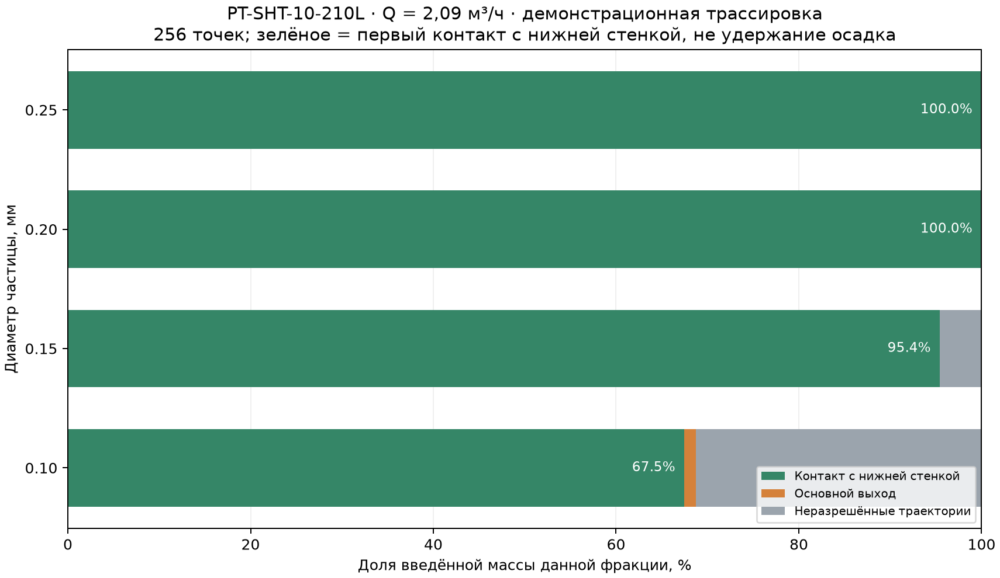
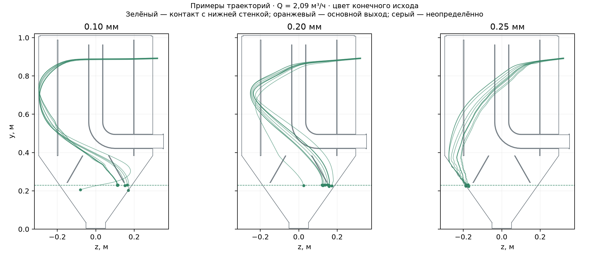

# PT-SHT-10-210L — перестроенная модель и предварительная проверка песка

3 октября 2026 г. Исходная сборка заказа не изменена. Расчёт относится к отдельной демонстрационной копии в `work/pt-sht-10-210l/Модель/PT-SHT-10-210L.SLDASM`.

## Конструкция и объём

Вставлено 175 мм прямого корпуса, внутреннего цилиндра и возвратного канала выше сечения `y≈600 мм`. Верхняя крышка и тангенциальный вход перенесены выше на 175 мм. Наружный внутренний Ø594 мм, внутренний цилиндр Ø400 мм, вход Ø51 мм, основной выход Ø78 мм, нижнее отверстие Ø102 мм сохранены. Нижний выпуск герметично закрыт при осаждении.

После сохранения и повторного открытия все 16 добавленных деталей активны. Геометрическое ядро выделило одну связанную жидкостную полость **210.230 л** без ошибок тел; она касается внутренней грани каждой из трёх крышек. Изображение: [полость 210 л](PT-SHT-10_полость_210л.png).

## Расчёт воды в SOLIDWORKS Flow Simulation

Принят полностью заполненный аппарат, вода около 20 °C, гравитация, стационарный режим, входной расход и давление на основном выходе. Противодавление реальной сети неизвестно; расчётное условие — атмосферная опорная величина Flow. Нижний Ø102 мм закрыт. Результаты `5.fld` и `4.fld` сохранены в CAD-проекте.

| Режим | Вход, м³/ч | Основной выход, м³/ч | Невязка, % | Потеря полного напора, м | Макс. локальная скорость, м/с | Ячейки жидкости | Итерации |
|---|---:|---:|---:|---:|---:|---:|---:|
| Текущий максимальный часовой | 2.0900 | 2.0900 | 0.00034 | 0.00708 | 0.318 | 334,467 | 174 |
| Дополнительная нагрузка | 10.0000 | 10.0000 | 0.00007 | 0.18640 | 1.571 | 334,467 | 395 |

Оба расчёта завершились сообщением `Execution succeeded`. Потеря полного напора учитывает разницу высот входа и выхода 0,4365 м. Отношение полного объёма к максимальному часовому расходу — **362 с**; оно не учитывает короткие пути и объём осадка. Скорость непосредственно в Ø51 мм: **0.284 м/с** при 2,09 м³/ч и **0.979 м/с** при кратком пике 2 л/с. Ранее упомянутые 1,36 м/с соответствуют 10 м³/ч и не сохраняются при новом расходе без изменения диаметра.

## Демонстрационная трассировка кварцевых частиц

Выполнена отдельная односторонняя трассировка по 3D-полю решённой воды: 256 взвешенных по входному потоку точек для каждой фракции, плотность кварца 2650 кг/м³, сферические частицы, сила тяжести и поправка сопротивления. Верхние стенки отражают, первый контакт со стенкой нижней зоны `y<0,229 м` заканчивает траекторию. Это **не штатная Particle Study SOLIDWORKS** и **не модель удержания/выгрузки**. Расход через нижнее отверстие при расчёте равен нулю.

| Диаметр, мм | Нижняя стенка при 2,09 м³/ч, % | Основной выход, % | Неопределённо, % | Нижняя стенка при 10 м³/ч, % |
|---:|---:|---:|---:|---:|
| 0.10 | 67.5 | 1.2 | 31.3 | 58.3 |
| 0.15 | 95.4 | 0.0 | 4.6 | 62.6 |
| 0.20 | 100.0 | 0.0 | 0.0 | 61.0 |
| 0.25 | 100.0 | 0.0 | 0.0 | 67.3 |

При более плотной выборке того же поля воды (12 мм) доли контакта с нижней стенкой: 0.10 мм: 67.7%, 0.15 мм: 95.7%, 0.25 мм: 100.0%. Это проверка интерполяции траекторий, не независимость CFD от расчётной сетки.

Вариант, где частица прилипает к **любой** стенке, дал для 0,10–0,25 мм более 95% остановки на стенках выше нижней зоны почти сразу после тангенциального входа. Это показывает сильную чувствительность к закону взаимодействия со стенкой; такой результат нельзя считать сбором песка. У 0,10 мм в основном варианте 31,3% траекторий численно неразрешены. Выборка поля 15 мм является шагом интерполяции, а не размером ячеек CFD.

**Требование 60% фактического удаления песка до 0,25 мм не подтверждено.** Неизвестны массовое распределение частиц, их форма, загрязнённость, реальная концентрация и сопротивление/режим выгрузки. Контакт со стенкой не доказывает, что осадок остаётся в накопителе и покидает его при выгрузке. Кратковременные 2 л/с и циклы между залпами не рассчитаны как нестационарное течение; 10 м³/ч служит дополнительной стационарной нагрузочной проверкой.

## Что требуется для подтверждения 60%

Проверить штатную геометрию через **Flow Simulation → Check Geometry → Check** и визуализировать Fluid Volume; выполненная геометрическая Boolean-проверка и успешная сетка Flow не заменяют протокол этой команды. Затем провести независимость поля и траекторий от расчётной сетки, выполнить Particle Study или верифицированную модель с калиброванным взаимодействием частиц со стенками, учесть краткий пик 2 л/с и заполнение бункера. Для фактической эффективности отбирать пробы на входе/выходе по фракциям и взвешивать выгруженный песок на представительном цикле автомойки. Подтверждающий показатель — масса песка `d≤0,25 мм`, удержанная и выгруженная из аппарата, делённая на введённую массу той же фракции.

## Передаваемые файлы

- `PT-SHT-10-210L_модель_и_Flow.zip`: CAD-копия с деталями и двумя завершёнными расчётами воды.
- `PT-SHT-10-210L_результаты.json`: численные значения, фракции и условия расчёта.
- Изображения полости, долей и траекторий в этой папке.
