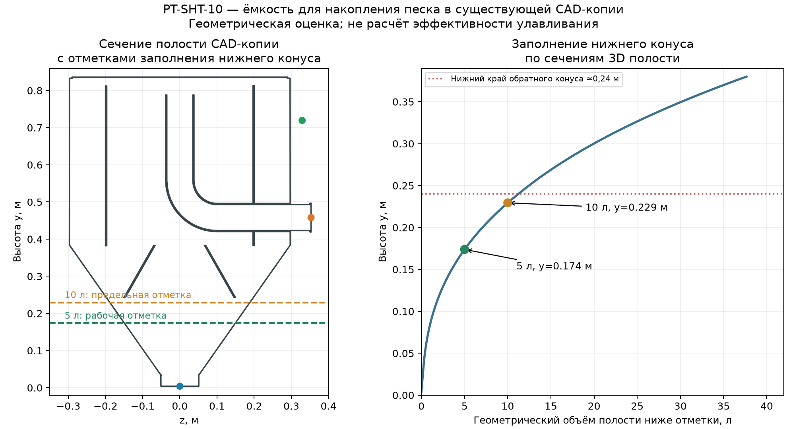

# PT-SHT-10 — объём песколовки и система накопления песка

3 октября 2026 г. **Предварительное инженерное назначение для доступного узла бункера; не подтверждение эффективности 60%.** Приёмная ёмкость 700 л из отдельного гидравлического расчёта находится **перед** песколовкой и в объём ниже не входит.

## Исходные данные и выбор расчётного расхода

| Параметр | Значение и статус |
|---|---|
| Суточный объём | 10 м³/сут — задан пользователем |
| Равномерный приток в пиковый час | 2,09 м³/ч — задан пользователем |
| Секундный максимум на входе системы | 2 л/с — задан пользователем |
| Цель по скорости во входе песколовки Ø51 мм | около 1,36 м/с во время работы — задана пользователем |
| Подача через песколовку в рабочем цикле | 10 м³/ч = 2,778 л/с — следует из цели по скорости и Ø51 мм |
| Фракция для контрольной проверки | 0,25 мм, сферический кварц 2650 кг/м³ — исследовательский случай |
| Удержание частиц | 60% — **цель**, не измеренный или подтверждённый результат |

Для объёма самой песколовки используется **10 м³/ч**, поскольку регулируемая подача из приёмной ёмкости обеспечивает именно этот расход во время работы. Секундный пик 2 л/с ниже подачи насоса, но его влияние на уровни в приёмной ёмкости проверяется отдельно.

## Водяной объём камеры

Контрольная полость CAD-копии бункера имеет **0,162543 м³ = 162,5 л** по геометрическому ядру; триангуляция для диаграммы дала 162,4 л (расхождение 0,09%). При 10 м³/ч полный геометрический объём соответствует `V/Q = 58,5 с`. Это номинальный показатель, а не распределение времени пребывания частиц. Геометрия копии включает заделку найденных зазоров и расчётные крышки; фактический рабочий уровень изготовленного изделия не подтверждён. [Привязка к CAD](PT-SHT-10_привязка_расчёта_к_модели.md).

Для предварительной компоновки принят **контрольный номинальный срок пребывания 60 с** на рабочем расходе. Тогда минимум *активного* проточного водяного объёма `10 × 60 / 3600 = 0,1667 м³`. С 20% компоновочным запасом принимается **0,200 м³ активной проточной зоны**, что даёт **72 с** номинально. Это выбранное расчётное допущение, а не нормативный критерий именно для этой тангенциальной конструкции. У [EPA](https://nepis.epa.gov/Exe/ZyPURL.cgi?Dockey=P1000S7N.TXT) 60 с указаны как типичный ориентир для *горизонтальной* песколовки; вихревые аппараты имеют другую гидродинамику, а её эффективность нельзя вывести из одного `V/Q`.

При отдельном резерве **0,010 м³ для накопленного песка и пульпы** требуемая на этой стадии полость в пустом состоянии равна **0,210 м³ = 210 л**. Это на **47,5 л больше** проверенной CFD-полости существующей копии. Если считать без 20% запаса, получаются `0,1667 + 0,010 = 0,1767 м³` — нижняя граница для выбранного критерия 60 с, но она не учитывает неравномерное течение и занятый внутренними элементами объём. Рекомендуемый **исследовательский вариант для нового CAD/CFD — 0,21 м³ общего жидкостного объёма при пустом накопителе, из них 0,20 м³ активно проточных и 0,01 м³ доступных под осадок**.

**Условие для грязной автомойки:** 10-литровая зона накопления допустима в этом варианте только с подтверждённой автоматической выгрузкой не реже одного раза на 1 м³ обработанной воды при исследовательском диапазоне песка до 2 г/л. При выгрузке раз в сутки нижний накопитель следует увеличить отдельно; численные варианты приведены ниже.

Важно: текущее значение 0,1625 м³ включает нижний конус. Если 10 л этой полости заняты осадком, остаётся не более **0,1525 м³** для воды, или **54,9 с** по отношению `V/Q`; реальная эффективно работающая часть может быть меньше из-за коротких путей и застойных зон.

## Накопитель в существующем нижнем конусе

По горизонтальным сечениям извлечённой CAD-полости, интегрированным по высоте, объём ниже отметки **y≈0,174 м — 5 л**, ниже **y≈0,229 м — 10 л**. Нижний край внутреннего обратного конуса на вертикальном сечении находится примерно у **y≈0,24 м**; ниже этой отметки геометрическая полость вмещает около **11,2 л**. Поэтому для существующей формы разумно рассматривать **5 л как рабочую отметку запуска выгрузки**, **10 л как верхнюю аварийную отметку**. Величины геометрические; фактический уровень влажного осадка может быть неровным, а его движение зависит от шнека и водяного потока.

[Численный профиль объёма нижнего конуса](PT-SHT-10_объём_нижнего_конуса_по_высоте.csv).

## Демонстрационный баланс песка: мойка грязных автомобилей

Пользователь уточнил тип стоков — **мойка грязных автомобилей**. Прежнее допущение 100 мг/л и выгрузка раз в 3 суток **отменены**. В [измерениях трёх автомоек](https://pmc.ncbi.nlm.nih.gov/articles/PMC7226662/) общая взвесь составляла примерно 1,26–3,42 г/л в среднем по отдельным объектам; это **не** концентрация чистого песка. В [другом полевом исследовании](https://www.mdpi.com/2571-8797/7/1/12) минеральная доля взвеси преобладала, но состав значительно менялся. Поэтому для предварительного расчёта **принимается, а не объявляется измеренной** концентрация *минерального песка* `Cпесок=1,0 г/л` (около **0,10% массы воды**) и диапазон чувствительности `0,5–2,0 г/л`. Массовая доля частиц `d≤0,25 мм` внутри этого песка **неизвестна** и не выводится из общей взвеси или доли минералов.

### Дополнительный сценарий из предоставленной декларации

По указанию пользователя [декларация о составе сточных вод](<Y:/700_Проекты/2026/20054 ИП ЛОПАТИНА НАТАЛЬЯ ЛЕОНИДОВНА Пескоуловитель/10_Данные_от_клиента/Декларация оригинал  МФЦ 2025 (5).pdf>) используется **только как справочный сценарий для расчёта аппарата 10 м³/сут**. На стр. 3 для одного канализационного выпуска указана общая взвесь **190 мг/дм³ = 190 мг/л**. На стр. 2 и 9 указан другой абонент, строительный вид деятельности и **112,61 м³/сут** общего отведения; эти расход и вид деятельности **не переносятся** на текущую автомойку. Декларация описывает сброс в сеть, а не пробу на входе песколовки, и не содержит отдельной концентрации песка или гранулометрии.

Если **исключительно для чувствительности** приравнять всю задекларированную взвесь к песку на входе текущего аппарата, то при 10 м³/сут получится **1,90 кг/сут** песка (0,019% массы воды). При верхнем сценарии 100% улавливания, `ρbulk=1,4 кг/л` и `K=3` объём влажного осадка составит **4,07 л/сут**. Рабочая отметка накопителя 5 л достигалась бы после **12,3 м³** обработанной воды, а полный геометрический резерв 10 л — после **24,6 м³**. В *этом условном сценарии* выгрузка раз в сутки совместима с 10-литровым накопителем. Число 190 мг/л нельзя выдавать за фактическую нагрузку песком мойки грязных автомобилей; до анализа входных проб сохраняется и более тяжёлый сценарий ниже.

Для объёма накопителя принят **верхний расчётный случай 100% поступающего песка**, так как использование целевых 60% для фракции ≤0,25 мм могло бы занизить объём при лучшем захвате крупных частиц. Демонстрационные параметры влажного осадка: насыпная плотность минерального скелета `ρbulk=1400 кг/м³`, коэффициент объёма с водой и органикой `K=3`. Их нужно заменить измерениями.

| Концентрация минерального песка на входе | Масса за 10 м³/сут | Планировочный объём влажного осадка при 100% улавливании | Объём обработанной воды до заполнения 5 л |
|---:|---:|---:|---:|
| 0,5 г/л | 5 кг/сут | 10,7 л/сут | 4,67 м³ |
| **1,0 г/л — основной сценарий** | **10 кг/сут** | **21,4 л/сут** | **2,33 м³** |
| 2,0 г/л | 20 кг/сут | 42,9 л/сут | 1,17 м³ |

Расчёт: `Mпесок(кг/сут) = Qсут(м³/сут) × Cпесок(г/л)`; `Vосадка(л/сут) = Mпесок(кг/сут) / 1,4(кг/л) × 3`. При 1 г/л существующие геометрические 10 л ниже обратного конуса могли бы заполниться после **4,67 м³** обработанной воды без выгрузки, при 2 г/л — после **2,33 м³**. Поэтому **ежедневная** выгрузка уже недостаточна для существующего 10-литрового накопителя при выбранном верхнем случае.

Для сохранения существующего конуса с 5-литровой рабочей отметкой предлагается **автоматическая выгрузка не реже чем после каждого 1 м³ обработанной воды**, с подтверждением, что фактический шнек опорожнил конус. Это даёт не более 4,29 л расчётного влажного осадка на 1 м³ при 2 г/л и полном улавливании. Если выгрузка предусмотрена только один раз в сутки, требуется **отдельный увеличенный накопитель**: порядка 30 л при основном 1 г/л и порядка 50 л при верхнем 2 г/л, включая округлённый запас над рассчитанными 21,4/42,9 л. При тех же 200 л активно проточной зоны суммарный объём аппарата составит ориентировочно **230 или 250 л** соответственно. Такой накопитель уже не помещается в нижней зоне существующей геометрии и требует перестройки узла.

## Предлагаемая схема осаждения и выгрузки

1. Подача воды из отдельной приёмной ёмкости насосом **10 м³/ч** в существующий тангенциальный вход Ø51 мм; основная осветлённая вода выходит через верхний/боковой основной отвод. Плавный пуск и постоянный расход во время цикла ограничивают изменение закрутки.
2. Тяжёлые частицы следуют к периферии и в нижний конус, где скорость воды должна уменьшаться; внутренний обратный конус должен прикрывать накопитель от обратного выноса. Реальная работа этого узла проверяется CFD и Particle Study. По [описанию EPA](https://nepis.epa.gov/Exe/ZyPURL.cgi?Dockey=P1000S7N.TXT) для вихревой песколовки характерны тангенциальный вход, нижний пескосборник и отдельное удаление накопленного песка.
3. **Нижний Ø102 мм выпуск считать соединением с песковым накопителем и выгрузкой**, а не непрерывным сливом 0,10 м³/ч воды из прежней демонстрационной CFD-постановки. Для режима накопления задавать герметичную границу; для выгрузки — отдельный кратковременный режим с учётом фактического шнека, клапана и отвода пульпы.
4. Предусмотреть закрываемый затвор на нижней линии, датчик уровня/заполнения или косвенный контроль по массе/времени, доступ для промывки конуса и вывод выгруженного песка в существующую систему шнека. Шнек в доступной сборке отсутствует, поэтому его диаметр, обороты, производительность и маршрут возврата дренажной воды **не рассчитаны**. До открытия затвора и после выгрузки предусмотреть управляемую промывку без выноса осадка в очищенный сток.
5. В приёмной ёмкости перед аппаратом предусмотреть перемешивание или очистку, иначе часть песка выпадет ещё до песколовки и фактическая нагрузка на неё изменится. Расход песка учитывать по пробам **до** и **после** всей системы.

## Что подтверждено и что остаётся проверить

Подтверждены арифметика расходов, геометрический объём жидкостной полости CAD-копии и профиль нижнего конуса. Аналитическая скорость свободного осаждения сферического кварца **0,25 мм составляет 0,034 м/с** в принятой воде; это свойство отдельной частицы, не эффективность установки. Даже при 0,20 м³ активного объёма **60% улавливания фракции до 0,25 мм не доказаны**: более мелкие частицы оседают существенно медленнее, а вихрь может переносить песок к выходу или повторно его поднимать. Предыдущая трассировка частиц была чувствительна к сетке и не годится для подтверждения эффективности.

До фиксации изготовления нужно: подтвердить фактический уровень воды и герметичность; отделить эффективную проточную зону от реальных застойных областей; пересчитать воду и частицы для пустого накопителя и уровней осадка 5/10 л; получить η(d), баланс `поступило → удержано → выгружено → вынесено`; проверить сеточную сходимость и влияние пусков/остановов. **0,21 м³ — конкретный вариант для этой проверки, а не сертифицированный минимальный объём для цели 60%.**
