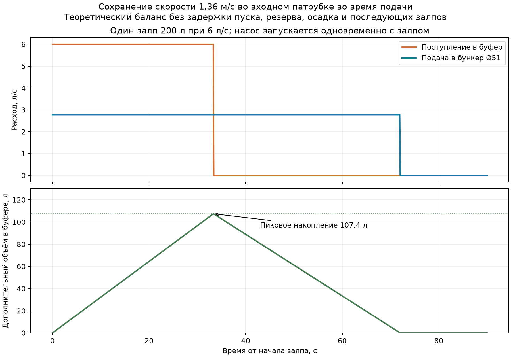

# PT-SHT-10 — новый режим 10 м³/сут и залп 200 л

> **Исторический сценарий, отменён уточнением пользователя.** Приток теперь задан как 900 л **равномерно за 40 минут** вместо 6 л/с. Актуальные выводы находятся в [уточнённом расчёте](PT-SHT-10_уточнённый_расчёт_900л_за_40мин.md); приведённые ниже объёмы буфера для залпов не использовать для нового режима.

3 октября 2026 г. Цель пользователя: сохранить **около 1,36 м/с во входном патрубке Ø51 мм во время подачи**, при поступлении отдельными залпами с паузами. Исходная расчётная полость бункера 0,162543 м³; [привязка к CAD](PT-SHT-10_привязка_расчёта_к_модели.md).

## Пересчёт расходов

| Показатель | Значение |
|---|---:|
| Среднесуточный приток | 10 м³/сут = 0,4167 м³/ч = 0,11574 л/с |
| Разовый залп | 200 л при 6 л/с = 21,6 м³/ч в течение 33.33 с |
| Скорость Ø51 мм при равномерных 10 м³/сут | 0.057 м/с |
| Скорость Ø51 мм при прямом приёме залпа | 2.937 м/с |
| Подача через Ø51 мм для 1,36 м/с | 10,0 м³/ч = 2.778 л/с |
| Номинальное V/Q бункера при 10 м³/ч | 58.5 с |
| Номинальное V/Q бункера при прямом залпе | 27.1 с |

Средняя за 24 часа скорость при 10 м³/сут через неизменный Ø51 мм равна только **0.057 м/с**. Непрерывно держать 1,36 м/с при таком чистом суточном расходе нельзя без внутренней рециркуляции. Реалистичная для принятой цели трактовка — держать 1,36 м/с **пока насос подаёт воду в бункер**, а между циклами насос останавливать. Общая работа при 10 м³/сут и 10 м³/ч составляет в идеале **1 час за сутки**.

Если весь суточный объём приходит порциями ровно по 200 л, это **50 залпов в сутки**; средний интервал между их началами был бы 28,8 мин. Это арифметическое среднее не задаёт минимальную паузу и не может служить основой для окончательного размера буфера.

## Баланс одного залпа

Предварительная схема: буфер перед бункером → управляемая подача 10 м³/ч → вход Ø51 мм. При запуске насоса **одновременно** с залпом за 33,33 с в буфер войдёт 200 л, в бункер уйдёт **92,59 л**, а в буфере накопится **107.41 л**. Всю порцию 200 л насос пропустит через бункер за **72.0 с** от начала пуска, то есть ещё 38.7 с после конца залпа.

**107.4 л — математический минимум дополнительного рабочего объёма для одного залпа при мгновенном пуске и неизменной подаче.** Если насос запускается только после конца залпа, нужно вместить все **200 л**. К обоим числам требуется добавить недоступный остаток, осадок, свободный борт, допуск регулирования и объём для последовательных залпов; их размер зависит от графика. Для произвольного графика полезный объём буфера считают по максимуму накопленной разности `∫(Qвход−Qподача)dt` за весь расчётный период.

Например, при **двух залпах подряд без паузы** и непрерывной работе насоса накопление вырастет до **214,8 л** перед добавлением резервов. Для опорожнения буфера после одиночного залпа требуется 72 с от его начала; пауза до следующего залпа должна быть больше этого времени, если каждый цикл должен начинаться с пустого буфера.

[Численная таблица с шагом 0,1 с](PT-SHT-10_баланс_одного_залпа.csv). Возможность сглаживать пики расхода буфером и необходимость проверить осаждение твёрдой фазы в нём соответствуют подходу [EPA к flow equalization](https://nepis.epa.gov/Exe/ZyPURL.cgi?Dockey=91013PZ0.TXT).

## Что менять в модели

1. **Бункер и вход Ø51 мм предварительно оставить**: при управляемой подаче 10 м³/ч его средняя скорость во входе равна прежней. Сохранять геометрию следует как исследовательский вариант, не как подтверждённое изделие.
2. Добавить перед бункером **отдельный приёмно-усреднительный объём** и управление насосом/регулятором расхода 10 м³/ч. Подачу 6 л/с напрямую в бункер не принимать, если требуется именно 1,36 м/с на входе.
3. Проверить накопление песка в буфере: предусмотреть его очистку или перемешивание и оценить изменение гранулометрии на входе бункера. Вместимость 0,162543 м³ самой CFD-полости не является полезным объёмом отдельного буфера.
4. Для нового режима решить воду и частицы при пуске, установленной подаче и остановке; подтвердить геометрию и сеточную сходимость. Предыдущая η(d) не верифицирована; 60% удержания песка не доказаны.

**Неизвестно:** число подряд идущих залпов, минимальные интервалы, задержка пуска, доступный напор/насос, концентрация и массовый расход песка. Без них нельзя окончательно назначить объём буфера и режим выгрузки осадка.

## Дополнение: до 900 л за 40 минут

Новое условие пользователя интерпретировано как **суммарный максимум за любой 40-минутный интервал**, при сохранении дневного объёма 10 м³ и разового залпа до 200 л с пиковым расходом 6 л/с. Если 900 л в каждом 40-минутном интервале поступают круглосуточно, это уже 32,4 м³/сут, поэтому такое повторение не следует из дневного задания.

| Показатель за 40 минут | Значение |
|---|---:|
| Средний приток за интервал | 900 л / 40 мин = 0,375 л/с = 1,35 м³/ч |
| Скорость при равномерной подаче напрямую в Ø51 мм | 0,184 м/с |
| Суммарное время регулируемой подачи 10 м³/ч | 5,4 мин за интервал = 13,5% времени |
| Скорость во время регулируемой подачи через Ø51 мм | 1,36 м/с |
| Математический пик буфера при поступлении всех 900 л подряд с 6 л/с и мгновенном пуске насоса | 483,3 л |
| Если насос запускается после окончания такой последовательности | 900 л |

Ограничение «не более 200 л за один залп» **само по себе не задаёт паузу**: несколько залпов суммарно до 900 л могут следовать подряд. Поэтому **107,4 л из расчёта одного залпа не является достаточным объёмом для нового 40-минутного условия**. Если залпы разделены паузами хотя бы до опорожнения буфера (72 с от начала каждого полного залпа при мгновенном пуске), максимальное накопление от каждого отдельного залпа вновь составляет 107,4 л. При отсутствии гарантированного интервала между залпами предварительную нижнюю границу полезного рабочего объёма следует принимать **483,3 л** при принятых идеальных условиях и добавлять остаток, осадок, резерв регулирования и свободный борт. Реальная верхняя граница зависит также от задержки пуска насоса; если пуск может произойти только после накопления 900 л, требуется не менее 900 л рабочего объёма до добавления резервов.

Результат является балансом расходов; он не подтверждает гидравлическую или пескоулавливающую эффективность CAD-узла. Для окончательного выбора буфера нужен фактический график пяти или более залпов внутри 40 минут и логика включения насоса.
