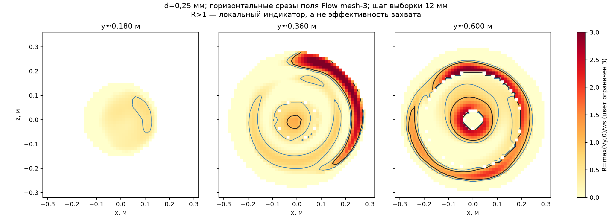

# PT-SHT-10 — повторное исследование по заданному протоколу

30 сентября 2026 г. **Статус: LEVEL 2 не прошёл контроль; эффективность улавливания и накопление осадка не утверждаются.** Повторная работа выполнена в отдельной демонстрационной копии модели. Исходная сборка заказа не изменена.

## Что повторено в этой проверке

1. Независимо пересчитаны силы сопротивления и скорости свободного осаждения **13 размеров** кварцевых сфер; невязка равновесия сил для каждой строки <10⁻⁷.
2. Повторно прочитаны журналы и сводки **трёх завершённых решателем сеток** воды. Совпадение SHA-256 сохранённого конечного `2.fld` и архива mesh-3 подтверждено.
3. По сохранённому полю mesh-3 заново вычислен трёхмерный индекс `R=max(Vy,0)/ws` для всех 13 размеров при шагах пространственной **выборки** 12 и 15 мм. Это два извлечения из **одного** CFD решения, а не две CFD сетки.
4. Повторно проверены массовые категории траекторий и их чувствительность к выборке поля. Условия CAPTURED из промта не выполнены; контакт со стенкой таковым не назван.

## Исходные данные и критерии

Демонстрационная постановка: полностью затопленная вода при 20 °C, **Q=10 м³/ч** на входе, 0 Па изб. на основном выходе и заданный отток 0,10 м³/ч через нижний патрубок. Гравитация `(0;−9,81;0)` м/с². Фактические подпор, уровень, вентиляция, Qmin/Qmax, массовые доли песка, концентрация, состояние слоя и режим выгрузки — **UNKNOWN / REQUIRED**. Эти величины не выведены из требований и не заменены выдуманными числами.

По промту переход к следующему уровню возможен после проверки предыдущего. Для LEVEL 2 контролируются не только интегральные потери напора, но и вертикальные скорости, рециркуляция и целевые показатели частиц на различных **CFD сетках**.

## LEVEL 1 — аналитическое осаждение: выполнено для демонстрационных свойств

Для сферы плотностью 2650 кг/м³ и воды ρ=997,574 кг/м³, μ=0,001001672 Па·с решено равенство веса с плавучестью и силы сопротивления с [корреляцией Шиллера — Наумана](https://doc.aspherix-dem.com/coupling/forceModel_SchillerNaumannDrag.html). Для **0,25 мм**: `ws=34.032 мм/с`, `Rep=8,47`, `Cd=4,68`. Закон Стокса дал бы завышение скорости на 65,1%. Реальная сферичность: **UNKNOWN**. [Полная таблица, 13 размеров](PT-SHT-10_аналитика_осаждения.csv).

## LEVEL 2 — вода: повторная проверка сохранённых решений

| CFD сетка | Жидкостные ячейки | Итерации | Потери полного напора, м | Невязка расхода, % |
|---:|---:|---:|---:|---:|
| 1 | 51,323 | 211 | 0.190598 | 0.000755 |
| 2 | 109,088 | 268 | 0.180873 | 0.000034 |
| 3 | 274,398 | 315 | 0.184125 | 0.000451 |

Между mesh-2 и mesh-3 потери напора изменились на **1.77%**. Этого недостаточно для прохода gate: не получены сравнимые по координатам поля вертикальной скорости и объёмы рециркуляции для всех трёх **CFD сеток**. Штатные `Check Geometry → Check → Fluid Volume` и сообщения контактов также не подтверждены в интерфейсе. Геометрическое ядро ранее выделило полость 0,162543 м³ и контакт трёх крышек; этот результат **не подменяет** запрошенную штатную проверку.

При повторной попытке открыть Flow COM возвращён `0x80010105` при `LoadAddIn(FW03.dll)`; `GetAddInObject(...)` вернул `None`, а объект результата не зарегистрирован в ROT. В журнале Windows Application Error за 30 сентября 2026 г. 07:44:31 указан сбой `sldworks.exe` в модуле **FW03.dll**, код исключения `0xc0000005` (нарушение доступа), смещение `0x2385d6`. Это конкретная причина отсутствия нового доступа к постпроцессору; принадлежность сбоя версии, установке или состоянию проекта без дополнительной диагностики не установлена. Сохранённые `mesh1/mesh2/mesh3` доступны как файлы и журналы, но в этом повторе снять новые поля с mesh-1/2 или вновь запустить решатель не удалось. Неудачную команду я не считал проверкой геометрии или новым решением.

### Трёхмерная карта восходящего потока из mesh-3

| Диаметр, мм | R>1, весь объём, шаг 12 мм, % узлов | Шаг 15 мм, % | Нижняя область y<0,35 м, шаг 12 мм, % | Шаг 15 мм, % |
|---:|---:|---:|---:|---:|
| 0.10 | 46.78 | 47.37 | 49.54 | 49.61 |
| 0.25 | 19.23 | 19.48 | 7.88 | 8.01 |
| 0.60 | 2.79 | 2.76 | 0.00 | 0.00 |

Для d=0,25 мм в нижней области: **7.88%** узлов при шаге 12 мм и **8.01%** при 15 мм имеют восходящее `Vy>ws`. Эти доли относятся к узлам регулярной выборки внутри CAD полости; пограничная дискретизация и отсутствие временной истории ограничивают точность. Близость двух долей показывает лишь устойчивость этого **интегрального индекса выборки**. Она не доказывает устойчивость траекторий или независимость CFD сетки. `R>1` не является вероятностью повторного уноса.

[Таблица индекса для 13 фракций и двух шагов выборки](PT-SHT-10_повторная_проверка_R_3D.csv). [Вертикальное сечение и карты для 0,10/0,25/0,60 мм](PT-SHT-10_карты_R.png).

## LEVEL 3 — сохранённые траектории, только диагностика

При 0,25 мм независимая односторонняя трассировка по mesh-3 дала **77.20%** введённой массы через нижнее отверстие при шаге выборки 12 мм и **99.22%** при 15 мм; разница **22.02 п.п.** При 12 мм ещё **21.92%** массы осталось в незавершённых траекториях через 180 с. Это сильная чувствительность к постобработке. Для 0,30 и 0,60 мм расхождение тоже велико. [Доли по всем шести размерам](PT-SHT-10_диагностика_фракций.csv); [разделение исходов](PT-SHT-10_осаждение_по_фракциям.png).

Штатный SOLIDWORKS Particle Study в сохранённом проекте не содержит работающего источника частиц; приведённые траектории получены внешней моделью из штатного поля воды. Стеночные коэффициенты, перенос турбулентностью, формирование/эрозия слоя и движение шнеком не проверены. Критерий **CAPTURED** должен включать пребывание в накопителе, направление движения, локальную скорость воды, `ws` и возможность последующего выхода. Он пока не реализован. Поэтому **η(d), d10/d50/d90/d95 и вероятность RE-ENTRAINED = TO_BE_CALCULATED**.

## LEVEL 4–5 — остановлено по gate

Численные `Mосадка(t)`, `Vосадка(t)`, `Hосадка(t)`, время выгрузки, `η(d,Q)` и `η(d,Q,Hs)` не рассчитывались: нет проверенной η и входной гранулометрии, Qmin/Qmax, плотности/пористости слоя и четырёх состояний заполнения. Осаждение песка из **объёма стоков** нельзя выразить корректным процентом без определения, что именно считается: масса песка данной фракции, общая масса песка или объём осадка. Для приёмки нужен массовый баланс песка по фракциям на входе и выходах.

**Повторный вывод:** решение воды на mesh-3 существует и аналитическая скорость осаждения рассчитана; демонстрационный показатель нижнего выхода **не подтверждает требуемые 60% удержания песка ≤0,25 мм**. Следующий необходимый этап — восстановить Flow, выполнить штатный Check Geometry и снять сопоставимые поля с трёх CFD сеток, затем устранить чувствительность модели частиц и задать проверяемый критерий CAPTURED.

Для расследования сбоя FW03.dll пригодна вкладка **Reliability** в [SOLIDWORKS Rx](https://help.solidworks.com/2026/english/SolidWorks/Sldworks/c_SOLIDWORKS_Rx.htm): она показывает стек неожиданного завершения и связанные события Windows. Если сбой повторяется в чистом сеансе, [штатная процедура восстановления установки](https://help.solidworks.com/2026/english/Installation/install_guide/t_repairing_installation.htm) требует исходные установочные файлы и сервисные пакеты; самостоятельно менять установленный продукт в рамках этого расчёта я не стал.
