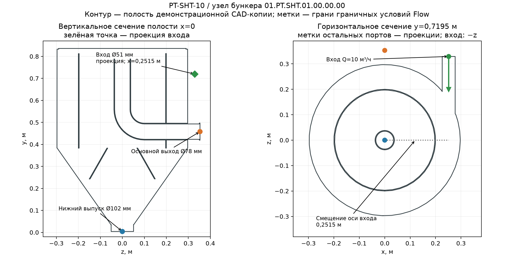

# Привязка расчёта к CAD-модели тангенциальной песколовки PT-SHT-10

3 октября 2026 г. Заказ №2418.1, изделие Vökker PT-SHT-10. **Расчёт относится к узлу бункера `01.PT.SHT.01.00.00.00 СБ  Бункер в сборе`, а не ко всей установке.**

## Идентификация модели

| Объект | Идентификатор |
|---|---|
| Исходная сборка | `C:\Users\adm\Desktop\РАБОТА\песколовка\01.PT.SHT (Заказ №2418 - НПСК) предварительный\01.PT.SHT (Заказ №2418 - НПСК)\Модель\01.PT.SHT.01.00.00.00 СБ  Бункер в сборе.SLDASM` |
| SHA-256 исходной сборки | `ea09fd30397ecb065d6b042b8dc58d089441ff8fe27c5db4e3b066889424ef89` |
| Контроль исходников | Все 33 CAD-файла из реестра от 01.10.2026 совпадают с записанными там SHA-256. Ревизия и конфигурация исходной сборки в реестре не заданы. |
| Снимок решённого CFD-проекта | Сборка внутри [архива Flow](PT-SHT-10_демо_проект_Flow.zip); SHA-256 `01cc6ce74898723d79a90c4875c7154576ba6cfe1eeb5427532b10f05fe68560` |
| Позднее сохранённая рабочая CFD-копия | `work\pt-sht-10-demo\Модель\01.PT.SHT.01.00.00.00 СБ  Бункер в сборе.SLDASM`; SHA-256 `f298e60717c27d86a378d843deb77c3d78aeefee40ab4397464a997361206709` |
| Проект Flow | `PT-SHT-10-demo-Q10-sealed`, конфигурация копии `По умолчанию` |
| Решённое поле | `work\pt-sht-10-demo\Модель\2\2.fld`; SHA-256 `d704850d5fec5733a6c508e95b533cabeda31cf2b7150aba46853ff776b67269` |

Путь `work\...` указан относительно рабочего каталога этой задачи. Из исходной сборки была создана отдельная копия для CFD. В ней сохранены все 33 исходных CAD-файла и добавлены 17 файлов с префиксом `CFD_` для исследовательской геометрии. Все 33 файла **текущей рабочей копии** бинарно отличаются от исходников; это **не означает**, что геометрия каждой детали изменилась. Сборка внутри архива была сохранена раньше рабочей копии; точное побайтовое соответствие этих двух сборок отсутствует. Файл результата `2.fld` в обоих местах имеет одинаковый SHA-256, поэтому для воспроизведения решённого проекта использовать **архивный снимок**. Модификации, важные для потока: закрытие трёх патрубков расчётными крышками, заделка найденных зазоров корпуса и стыков, удлинение нижнего отвода. Соответствие этих изменений изготовленному изделию не подтверждено.

## Геометрия и граничные условия

Вертикальная ось в CAD — **y**; гравитация направлена по `−y`. Геометрическое ядро SOLIDWORKS выделило в CFD-копии одну связанную полость **0,162543 м³** и показало контакт с внутренними гранями всех трёх расчётных крышек. Это независимая геометрическая проверка, **не** протокол штатной команды Flow `Check Geometry → Fluid Volume`.

| Сечение | Центр грани, м `(x; y; z)` | Размер по грани | Условие демонстрационного расчёта |
|---|---|---|---|
| Вход | `(0,2515; 0,7195; 0,329)` | Ø51 мм | 10 м³/ч в бункер |
| Основной выход | `(0; 0,458; 0,353)` | Ø78 мм | 101325 Па абсолютного давления, около 0 Па избыточного на выходе |
| Нижний выпуск | `(0; 0,004; 0)` | Ø102 мм | Заданный отток воды 0,10 м³/ч |

Ось входного патрубка расположена на **251,5 мм** от вертикальной оси корпуса при внутреннем радиусе цилиндра около **297 мм**. Вход направлен в сторону `−z`; эта боковая врезка задаёт закручивание потока в модели. Геометрия трубы и направление подтверждаются поверхностями и координатами CFD-копии, но эксплуатационные входные скорости по сечению и поведение полной песколовки требуют отдельной проверки.

В [машиночитаемом паспорте привязки](PT-SHT-10_привязка_расчёта_к_CAD.json) записаны пути и SHA-256, отдельные хэши архивного снимка и поздней рабочей копии, координаты и UUID граничных граней Flow. [Архив решённого проекта](PT-SHT-10_демо_проект_Flow.zip) содержит сборку и соответствующий файл `2.fld` для воспроизведения.

## Какие результаты относятся к этому узлу

- Гидравлика: три завершённые сетки воды; финальная — 274 398 жидкостных ячеек, потери полного напора **0,184125 м** при 10 м³/ч. [Подробный отчёт по воде](PT-SHT-10_повторный_расчёт_воды.md).
- Осаждение сферического кварцевого песка: аналитическая свободная скорость при **d=0,25 мм — 34,03 мм/с**. [Таблица фракций](PT-SHT-10_аналитика_осаждения.csv).
- Предварительная трассировка по сохранённому полю воды: для d=0,25 мм через нижнее отверстие прошло **77,20%** введённой массы при шаге выборки 12 мм и **99,22%** при 15 мм. Это диагностические выходы внешней модели, **не подтверждённая эффективность удержания**. [Аудит сеточной чувствительности](PT-SHT-10_повторное_исследование_по_промту.md).

## Граница привязки к изделию

Доступная CAD-папка содержит бункер с внутренним цилиндром, обратным конусом и патрубками; отдельной полной сборки установки со шнеком, всей обвязкой и фактическими входным/выходным трубопроводами в ней нет. Ориентировочные габариты изделия из паспорта заказа — 4000×1500×3000 мм — не являются габаритами смоделированной жидкостной полости. Поэтому переносить вычисленную потерю напора или долю нижнего выхода на паспортные характеристики **всей тангенциальной песколовки** нельзя.

Статус исследования остаётся **BLOCKED — MESH DEPENDENCE**: сходимость целевых показателей частиц не достигнута, реальная гранулометрия и рабочие условия неизвестны, критерий долгосрочного `CAPTURED` не проверен. Требование 60% удержания песка до 0,25 мм для изделия не подтверждено.
