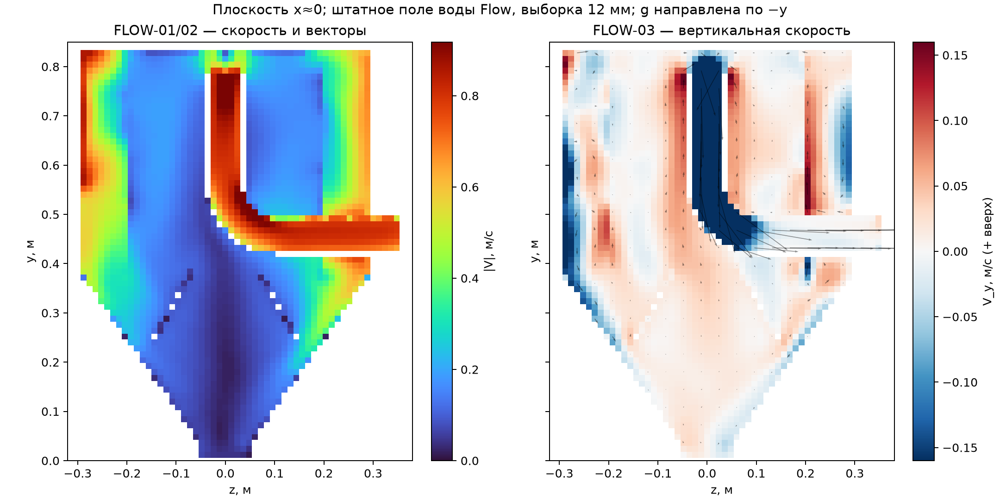
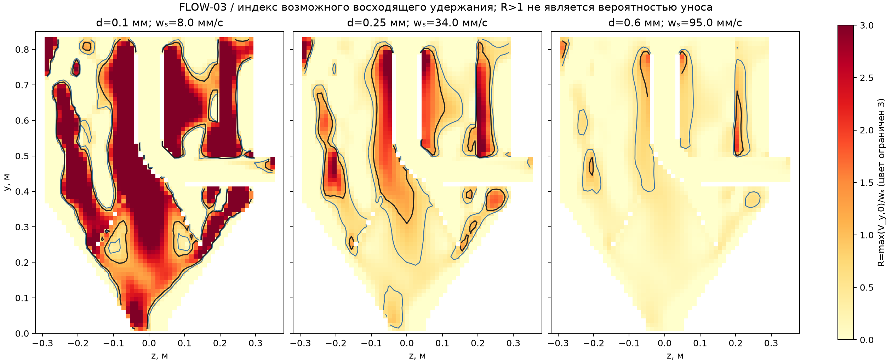
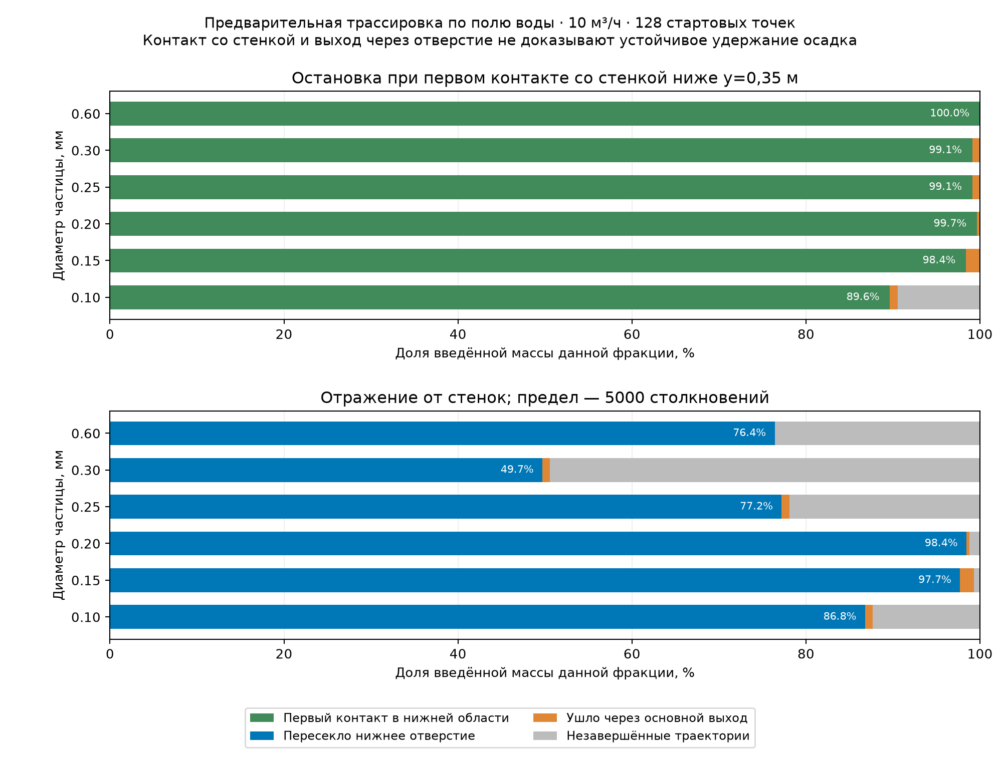
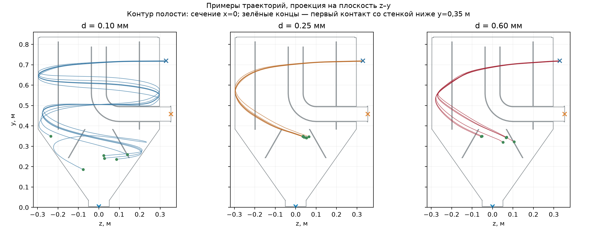
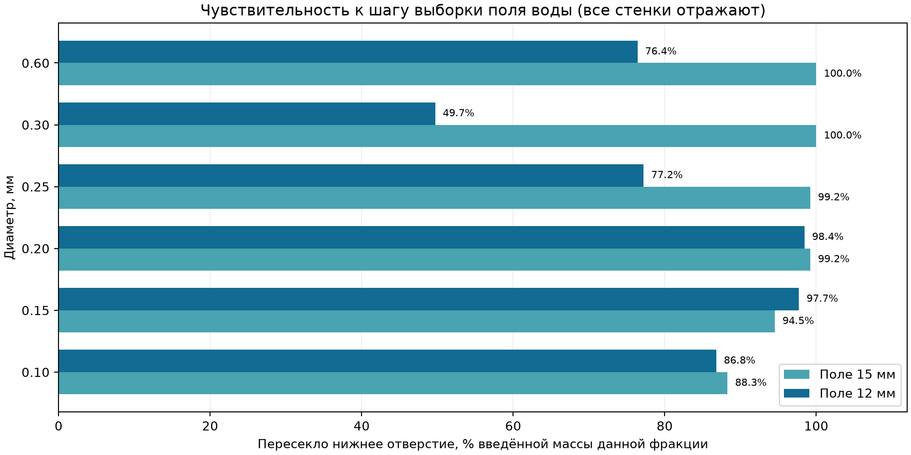

# PT-SHT-10 — аналитика осаждения и аудит CFD/частиц

30 сентября 2026 г. **Статус: предварительная демонстрационная модель; приёмочная эффективность не получена.** Исходная сборка заказа не менялась. Расчёты выполнены в её отдельной копии.

## Что удалось установить

На решённом поле воды SOLIDWORKS Flow при **Q=10 м³/ч** построены карты скорости и индекса восходящего потока, выполнен независимый расчёт свободного осаждения кварцевых сфер и диагностическая трассировка шести размеров песка. Для **d=0,25 мм** аналитическая скорость свободного осаждения равна **34,03 мм/с**. В модели траекторий с отражающими стенками **77.2%** введённой массы этой фракции пересекло нижнее отверстие при выборке поля 12 мм; **21.9%** введённой массы осталось в незавершённых траекториях через 180 с. При выборке 15 мм доля нижнего выхода стала **99.2%**. Разность **22.0 процентного пункта** не позволяет считать результат по частицам пространственно независимым.

Контакт со стенкой в нижней области, пересечение нижнего отверстия и долговременное удержание осадка являются **разными событиями**. Показанные ниже проценты не представляют η(d)=Mзахвачено/Mвведено. Критерий CAPTURED с проверкой пребывания в накопителе и последующего выхода пока не реализован; вероятность повторного уноса не установлена.

## Исходные данные и допущения

| Категория | Данные / статус |
|---|---|
| AS-IS | Геометрия из копии CAD; выделенный объём полости 0,162543 м³. Реальное состояние сварных швов, уплотнений и трёх крышек: TO_BE_MEASURED. |
| TARGET | 10 м³/ч и удаление 60% песка фракций до 0,25 мм — ранее заявленная цель; определение процента и фактическая гранулометрия: REQUIRED. |
| DEMO CALCULATION | Полностью затопленная однофазная вода 20 °C, ρ=997,574 кг/м³, μ=0,001001672 Па·с, g=(0;−9,81;0) м/с²; кварцевые сферы ρₚ=2650 кг/м³, ψ=1. |
| Границы DEMO | Вход 10 м³/ч, основной выход около 0 Па изб., нижний заданный отток 0,10 м³/ч. Реальные подпор, уровень, вентиляция и гидравлика выгрузки: UNKNOWN. |
| Эксплуатация | Qmin, Qmax, концентрация песка, массовые доли фракций, свойства и толщина слоя, степень заполнения: UNKNOWN. |
| NORMATIVE / PRODUCTION | Применимый нормативный профиль и производственные ограничения: REQUIRED. |

Утверждение «60% от общего объёма загрязнённых стоков» неоднозначно: эффективность улавливания песка должна иметь **массовую базу** (масса захваченного песка данной фракции / введённая масса той же фракции). Объём воды и масса песка не взаимозаменяемы. Фактическую интерпретацию цели нужно закрепить до приёмочного вывода.

## LEVEL 1 — независимый расчёт осаждения

Решено равенство веса с поправкой на плавучесть и силы сопротивления сферы: `0,5 Cd ρ A ws² = (ρp−ρ) V g`. Число Рейнольдса `Rep=ρ d ws/μ`; корреляция Шиллера — Наумана `Cd=24(1+0,15 Rep^0,687)/Rep` при Rep≤1000. Корень получен итерационно; относительная невязка сил для каждой строки <10⁻⁷. Для всех рассчитанных размеров Rep<1000. Предположение ψ=1 требует замены, если лабораторная форма песка отличается.

| d, мм | Rep | Cd | ws, мм/с |
|---:|---:|---:|---:|
| 0.050 | 0.11 | 228.64 | 2.2 |
| 0.100 | 0.79 | 34.10 | 8.0 |
| 0.150 | 2.38 | 12.85 | 15.9 |
| 0.200 | 4.94 | 7.04 | 24.8 |
| 0.250 | 8.47 | 4.68 | 34.0 |
| 0.300 | 12.93 | 3.47 | 43.3 |
| 0.500 | 39.11 | 1.76 | 78.5 |
| 0.600 | 56.79 | 1.44 | 95.0 |
| 1.000 | 154.68 | 0.90 | 155.3 |
| 2.000 | 565.46 | 0.54 | 283.9 |

Полная сетка из 13 размеров, включая 0,075; 0,75 и 1,50 мм, содержится в [CSV](PT-SHT-10_аналитика_осаждения.csv). Для 0,25 мм закон Стокса дал бы скорость выше на **65,1%**; применять его во всём диапазоне нельзя.

## LEVEL 2 — гидродинамика воды

Решатель Flow завершил три сетки: 51 323 / 109 088 / 274 398 жидкостных ячеек. Для последней сетки: 315 итераций, вход 10,000000 м³/ч, основной выход 9,900045 м³/ч, низ 0,100000 м³/ч, невязка расхода 0,000451%, потери полного напора 0,184125 м. Изменение этого напора между двумя подробными сетками 1,77%. Подробности и файлы проекта — в [отчёте по воде](PT-SHT-10_повторный_расчёт_воды.md).

**Gate Level 2: BLOCKED — MESH DEPENDENCE.** Проверена только сходимость одного интегрального гидравлического показателя. Сходимость вертикальной скорости, объёма рециркуляции, показателя R и η(d) на разных **CFD сетках** не доказана. Сравнение выборки поля 15/12 мм ниже также не заменяет сравнение CFD сеток. Штатный протокол `Check Geometry → Fluid Volume` остаётся незакрытым, несмотря на выделение полости геометрическим ядром и построение сетки Flow.

Вертикальная координата данной сборки — **y**; положительное `V_y` направлено вверх. На картах R использовано `max(V_y,0)/ws`. `R>1` показывает локальный риск удержания восходящим потоком, а не измеренную вероятность уноса или величину эффективности. В сечении x≈0 доля узлов выборки с R>1: около 50,7% для 0,10 мм, 18,6% для 0,25 мм и 2,0% для 0,60 мм. Это **доля узлов указанного сечения**, а не доля объёма аппарата.

## LEVEL 3 — диагностические траектории, без статуса CAPTURED

Штатный SOLIDWORKS Particle Study не завершён: инжекция создавалась через API, но после сохранения список источников оставался пустым. Отдельная модель прослеживает частицы по **реальному полю воды** из файла `2.fld`. Вход — физическое сечение патрубка Ø51 мм; 128 квазислучайных стартовых точек взвешены локальным расходом. Начальная скорость равна скорости воды; сопротивление Шиллера — Наумана и тяжесть с плавучестью. Контакты со стенкой в сценарии отражения заданы демонстрационными коэффициентами 0,2 по нормали и 0,75 по касательной. На границе нерегулярной полости пропущенные узлы регулярной сетки заполнены ближайшим жидкостным значением перед интерполяцией; это дополнительный источник ошибки около стенок. Турбулентное рассеивание, реальная шероховатость, движение слоя, шнек и влияние частиц на воду не рассчитаны.

| d, мм | Первый контакт с нижней областью¹, % | Нижний выход², % | Основной выход², % | Не завершено², % | Δ нижнего выхода 12−15 мм, п.п. |
|---:|---:|---:|---:|---:|---:|
| 0.10 | 89.6 | 86.8 | 0.9 | 12.3 | -1.5 |
| 0.15 | 98.4 | 97.7 | 1.6 | 0.7 | +3.2 |
| 0.20 | 99.7 | 98.4 | 0.3 | 1.2 | -0.8 |
| 0.25 | 99.1 | 77.2 | 0.9 | 21.9 | -22.0 |
| 0.30 | 99.1 | 49.7 | 0.9 | 49.4 | -50.3 |
| 0.60 | 100.0 | 76.4 | 0.0 | 23.6 | -23.6 |

¹ Сценарий останавливает частицу при первом контакте со стенкой ниже y=0,35 м. Это лишь **место первого контакта**; положение на фактическом слое и удержание не проверены. ² Сценарий с отражением от всех стенок, пределы 180 с / 10 000 шагов / 5000 столкновений. Доли взвешены по входному расходу. Сумма всех категорий, включая нулевые обратный вход и прочие стены, составляет 100% для каждой строки. Незавершённые траектории не добавлялись к выходам.

Рост числа стартовых точек до 256 для 0,25 мм при пределе 5000 столкновений дал 76,25% нижнего выхода на поле 12 мм против 77,20% при 128 точках; это не снимает расхождение между шагами выборки поля. При 128 точках увеличение предела столкновений с 2000 до 5000 изменило результат с 76,33% до 77,20%, оставив 21,92% траекторий незавершёнными через 180 с. Баланс весов траекторий закрыт по учтённым численным исходам, но физический баланс `Mcaptured + Mescaped + Msuspended` пока не может быть закрыт без критерия CAPTURED.

## LEVEL 4–5 — расчёты, которые пока нельзя подтвердить

- **η(d), d10/d50/d90/d95:** TO_BE_CALCULATED после верификации поля и критерия удержания; нельзя интерполировать d50 по диагностическим выходам.
- **η(d,Q), η(d,Q,Hs):** REQUIRED значения Qmin/Qmax и режимы FILL-0/25/50/75 с повторной CFD проверкой. Оценка при одном Q и пустом накопителе не даёт карты.
- **Повторный унос:** TO_BE_CALCULATED. Индекс R отмечает риск; для вероятности нужен временной учёт выхода из накопителя или натурный опыт. Текущая модель не воспроизводит эрозию слоя.
- **Mосадка(t), Vосадка(t), Hосадка(t), время 25/50/75/90%:** TO_BE_CALCULATED после определения η, входных массовых расходов фракций, повторного уноса, насыпной плотности/пористости, геометрии полезного объёма и предела выгрузки. Формулы: `dMi/dt=ṁin,i ηi−ṁre,i`, `Vs=Ms/ρbulk`, `Hs=fCAD(Vs)`; чисел без входных данных нет.
- **Концентрация / CFD–DEM:** концентрация UNKNOWN; применимость односторонней модели не проверена. Если значимы взаимодействие частиц, рост и эрозия слоя, потребуется более подробная многофазная модель и проверка опытом.

## Условия для приёмочного результата

1. В интерфейсе Flow завершить `Check Geometry`, записать объём/сообщения, показать `Fluid Volume` на внутренних гранях трёх крышек; сверить копию CAD с изготовленным аппаратом.
2. Уточнить фактические Qmin/Qnom/Qmax, уровень и подпор на обоих выходах, вентиляцию, режим выгрузки и гранулометрию с массовой концентрацией.
3. Довести контроль воды на трёх CFD сетках по вертикальной скорости и рециркуляции; устранить чувствительность трассировки к шагу выборки и времени наблюдения.
4. Реализовать проверяемый критерий удержания и повторного уноса, затем посчитать η(d) и перейти к сценариям заполнения/накопления.

**Итог:** цель «60% для d≤0,25 мм» на текущем уровне доказательств **не подтверждена и не опровергнута**. Доля нижнего выхода в демонстрационной траектории служит диагностикой постановки, не паспортной эффективностью.

## Методические источники

- [Документация по корреляции Шиллера — Наумана](https://doc.aspherix-dem.com/coupling/forceModel_SchillerNaumannDrag.html).
- [SOLIDWORKS Flow Simulation: поддержка Particle Studies](https://help.solidworks.com/2019/English/SolidWorks/floxpress/c_comparing_floxpress_flow_simulation.htm).
