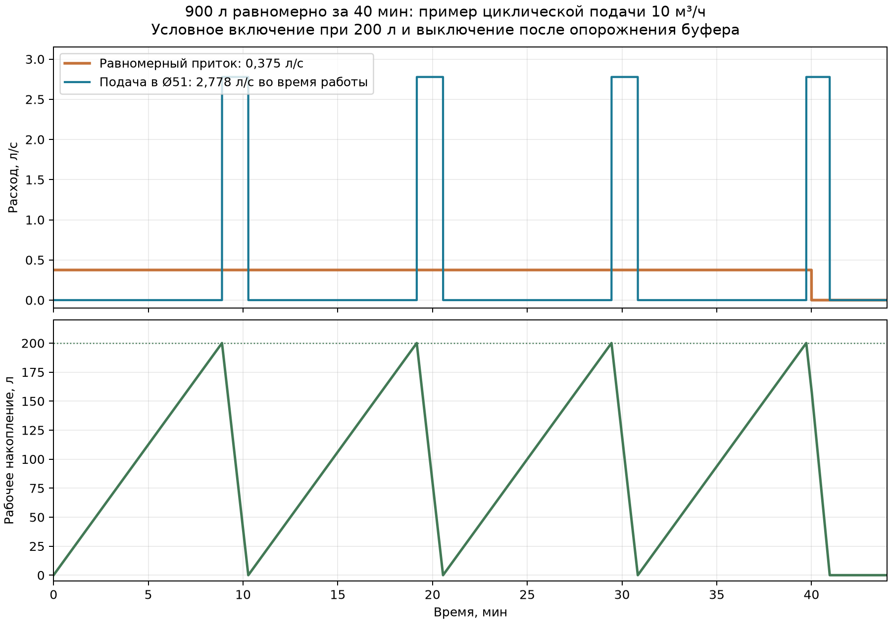

# PT-SHT-10 — режимы 900 л/40 мин, 2,09 м³/ч и секундный максимум 2 л/с

> **Архивный расчёт.** Пользователь исключил 40-минутный режим из исходных данных. Актуальные числа и выводы приведены в [действующем гидравлическом расчёте](PT-SHT-10_актуальный_гидравлический_режим.md). Приведённую ниже схему циклов не использовать для выбора буфера.

3 октября 2026 г. Уточнения пользователя: вместо ранее принятого притока 6 л/с задано **900 л равномерно за 40 минут**; **максимальный часовой расход 2,09 м³/ч распределён внутри часа равномерно**; **максимальный секундный расход 2 л/с**. Секундный максимум интерпретирован как кратковременное отклонение от ровной основной подачи при сохранении часового объёма. Прежний сценарий залпа 200 л при 6 л/с и рассчитанные для него 107,4–483,3 л буфера **к актуальному режиму не применяются**. Суточный объём остаётся 10 м³/сут. Целевая скорость — около 1,36 м/с во входном патрубке Ø51 мм во время подачи в песколовку.

## Расход и скорость

| Показатель | Значение |
|---|---:|
| Приток в течение 40 минут | 900 л / 40 мин = **0,375 л/с = 1,35 м³/ч** |
| Скорость при прямой подаче этого притока в Ø51 мм | **0,184 м/с** |
| Расход для 1,36 м/с в Ø51 мм | **10 м³/ч = 2,778 л/с** |
| Время подачи 900 л при 10 м³/ч | **5,4 мин** |
| Доля работы насоса внутри 40 минут | **13,5%** по суммарному времени |
| Суточное время подачи 10 м³ при 10 м³/ч | **1 час** |

Равномерный приток 1,35 м³/ч сам по себе не обеспечивает 1,36 м/с в Ø51 мм. Чтобы сохранить эту скорость во время работы песколовки, нужен небольшой приёмный буфер и циклическая подача 10 м³/ч. Скорость 1,36 м/с относится к периодам включённого насоса, а не к среднему за 24 часа.

## Демонстрационный вариант управления

Показан **пример, не окончательная спецификация буфера**: насос включается, когда рабочее накопление достигает 200 л, и выключается после опорожнения; при этом приток 0,375 л/с продолжается 40 минут. Расчётный максимум накопления около **200 л**; насос включается 4 раза приблизительно на 8,89-й, 19,17-й, 29,45-й и 39,72-й минутах. Последний цикл заканчивается после 40-й минуты. Суммарно 900 л проходят в песколовку за 5,4 минуты работы насоса.

[Численный баланс с шагом 1 с](PT-SHT-10_равномерный_900л_40мин_баланс.csv).

Для выбора реального рабочего объёма нужны минимальное допустимое время работы насоса, запас на пуски и остановы, полезный остаток, осадок и свободный борт. При минимальном времени включения `t_min` и постоянном притоке требуемый перепад рабочего уровня за цикл не меньше `(10 − 1,35) × t_min` м³, если `t_min` выражено в часах. Например, для одной минуты это **144 л**. Это перепад рабочего уровня, а не полный геометрический объём резервуара.

Если равномерный расход 1,35 м³/ч сохраняется круглые сутки, суточный объём будет **32,4 м³/сут**, что не согласуется с заданными 10 м³/сут. При 10 м³/сут такая подача может длиться суммарно около **7 ч 24 мин за сутки**, если других притоков нет.

## Проверка максимального часового расхода 2,09 м³/ч

В пиковый час базовый приток принят равномерным и равным **2,09 м³/ч**, а кратковременное значение расхода за отдельную секунду может достигать **2 л/с**. Для контрольного расчёта:

| Показатель | Значение |
|---|---:|
| Равномерный приток в пиковый час | **2,09 м³/ч = 0,581 л/с** |
| Скорость при прямой подаче через Ø51 мм | **0,284 м/с** |
| Суммарная работа насоса 10 м³/ч за этот час | **12,54 мин**, если начальный и конечный уровни буфера совпадают |
| Для условного включения при 200 л: время заполнения от пустого буфера | **5,74 мин** |
| Для того же условного цикла: время опорожнения 200 л во время продолжающегося притока | **1,52 мин** |
| Расход в самую нагруженную секунду | **2 л/с = 7,2 м³/ч** |
| Скорость в Ø51 мм при прямом пропуске этих 2 л/с | **0,979 м/с** |
| Превышение подачи насоса 10 м³/ч над максимальным секундным притоком | **0,778 л/с** |

Следовательно, **подачу 10 м³/ч и вход Ø51 мм можно сохранить как исходную рабочую точку** и для пикового часа; насос будет включаться чаще. При условной уставке 200 л цикл составит около 7,26 мин, то есть примерно 8 пусков в час. Допустимость такого числа пусков зависит от выбранного насоса и автоматики; 200 л здесь только иллюстрация, а не назначенный геометрический объём бака.

Подача насоса **2,778 л/с превышает секундный максимум притока 2 л/с**: во время работы насоса уровень буфера может только снижаться при принятых пределах расхода. Пик 2 л/с всё же может поднять уровень, когда насос выключен; при мгновенном включении по уставке 200 л расчётное превышение за одну секунду составит не более 2 л, но для автоматики нужно учесть задержку включения, частоту пусков и свободный борт.

**Согласование двух режимов:** равномерные 2,09 м³/ч за 40 минут дают **1 393 л**, что больше указанных ранее 900 л за 40 минут. Оба утверждения совместимы, если 900 л/40 мин описывают **отдельный рабочий режим**, а не абсолютный максимум любого 40-минутного окна. Если 900 л — жёсткий максимум для любого такого окна, хотя бы одно из условий нужно уточнить; окончательный объём буфера до этого назначать нельзя.

## Привязка к существующей модели

Вход Ø51 мм бункерного узла можно оставить как исходный исследовательский вариант: при регулируемой подаче 10 м³/ч скорость во входе соответствует прежней постановке. Приёмный буфер следует считать **отдельным узлом до песколовки**; объём водяной полости существующей CAD-модели 0,162543 м³ нельзя автоматически принимать как его полезный объём. [Прежняя привязка к CAD](PT-SHT-10_привязка_расчёта_к_модели.md) описывает геометрию, но не подтверждает эффективность пескоулавливания при новой циклической работе.

Этот результат — **баланс расходов**, а не новый расчёт течения или осаждения частиц в SOLIDWORKS Flow Simulation. Сохранение входной скорости не доказывает прежнее распределение потоков и требуемые 60% удаления частиц до 0,25 мм; для этого нужен отдельный расчёт циклов и проверка модели.
