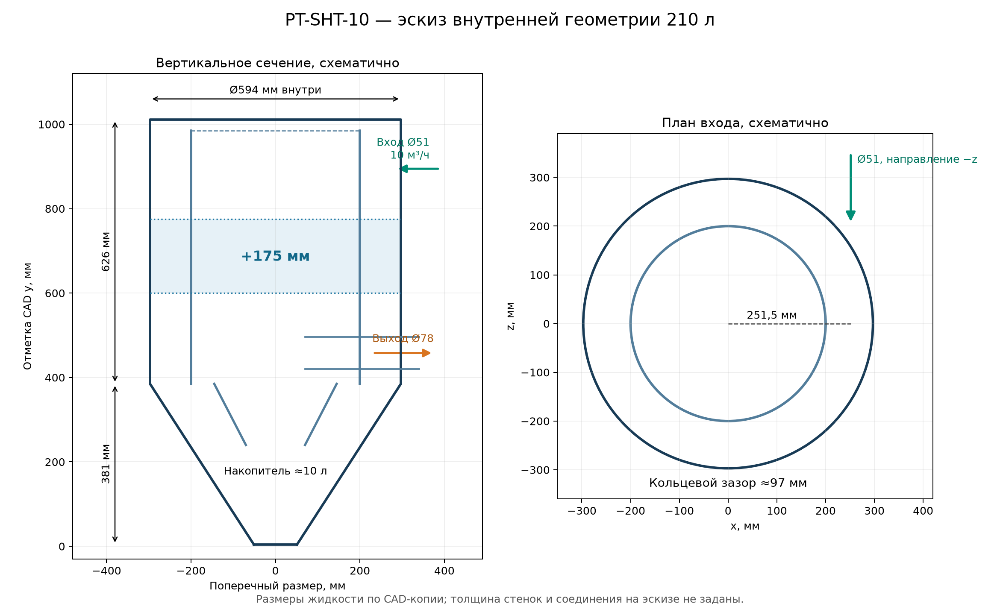

# PT-SHT-10 — размерный вариант тангенциальной песколовки 210 л

3 октября 2026 г. **Эскиз для перестройки CAD-копии**, не выпускной чертёж. Размеры ниже относятся к **внутренней гидравлической геометрии**; толщины стенок, прочность, сварные швы и фланцы требуется назначить конструкторским расчётом. Исходная сборка заказа сохраняется без изменений.

## Размеры и привязка к существующему узлу

Ось `y` вертикальна; за нулевую отметку таблицы принят центр нижнего выходного отверстия исходной CAD-копии. В существующей модели он расположен при `y=4 мм` в координатах сборки. Для удобства ниже отметки округлены относительно этого нуля; при перестройке использовать именно координаты исходной модели из [привязки к CAD](PT-SHT-10_привязка_расчёта_к_модели.md).

| Элемент | Предлагаемый внутренний размер или отметка | Действие в CAD |
|---|---:|---|
| Наружный цилиндр, внутренний диаметр | **Ø594 мм** | Сохранить |
| Нижний конус, верхний внутренний диаметр | **Ø594 мм** | Сохранить |
| Нижний конус, выход | **Ø102 мм** | Сохранить; на время накопления герметично закрывать |
| Высота конуса от нижнего выхода до начала цилиндра | **≈381 мм** | Сохранить профиль и переходы исходной модели |
| Прямой цилиндрический участок от начала цилиндра до внутренней верхней крышки | **≈626 мм** вместо ≈451 мм | Удлинить на **175 мм** |
| Общая внутренняя высота от нижнего выхода до верхней крышки | **≈1007 мм** вместо ≈832 мм | Следствие удлинения |
| Внутренний цилиндр / центральный возвратный канал | Наружный диаметр **≈400 мм**; радиальный зазор до корпуса **≈97 мм** | Сохранить профиль и удлинить пересечённый прямой участок на 175 мм |
| Ось тангенциального входа | **Ø51 мм**, смещение оси **251,5 мм** от оси корпуса, высота **≈890,5 мм** над нижним выходом | Сохранить направление `−z`, перенести выше на 175 мм |
| Ось основного выхода | **Ø78 мм**, высота **≈454 мм** над нижним выходом | Сохранить на прежней отметке |
| Перепад отметок осей входа и основного выхода | **≈436,5 мм** | Следствие переноса входа |
| Объём нижней зоны до старой отметки `y≈229 мм` | **≈10 л** | Сохранить конус и предусмотреть контроль заполнения |

**Способ перестройки:** вставить 175 мм прямой длины на горизонтальном сечении существующей сборки `y≈600 мм` (координата CAD). Все верхние элементы, включая тангенциальный вход, верхнюю крышку и верх внутреннего цилиндра, перенести на 175 мм; нижний конус, обратный конус и основной выход оставить на прежних отметках. Вертикальные стенки, пересечённые плоскостью вставки, продолжить без ступеней и зазоров. Такой способ сохраняет характер входа и нижней зоны, но меняет длину пути потока, поэтому требует нового расчёта.

## Проверка объёма и рабочего расхода

В существующей герметизированной CFD-копии измерена связанная водная полость **162,543 л**. По сечению экспортированной полости в прямом участке `y≈0,55–0,65 м` площадь жидкостного прохода составляет примерно **0,2724 м²** (включает кольцевую зону и внутренний возвратный канал, за вычетом стенок). Вставка 175 мм прибавит ориентировочно `0,2724 × 0,175 = 0,04767 м³ = 47,67 л`. Поэтому ожидаемый геометрический объём пустой полости — **≈210,21 л**. Окончательное значение нужно получить командой проверки жидкостного объёма после перестройки CAD; расчёт по сечению не учитывает возможные изменения стыков и сварных переходов.

Если 10 л нижнего накопителя заняты осадком, геометрически доступно около **200,2 л воды**. При подаче **10 м³/ч** номинальное отношение `V/Q` равно **≈72,1 с**. Это не доказательство, что все 200,2 л эффективно омываются; застойные зоны и короткий путь определяются по новому полю скоростей.

Расход 10 м³/ч даёт **1,36 м/с** в Ø51 мм и **0,581 м/с** в Ø78 мм при закрытом нижнем выпуске. Для сравнения, [EPA](https://nepis.epa.gov/Exe/ZyPURL.cgi?Dockey=P1000S7N.TXT) приводит типичный ориентир скорости входа в вихревую песколовку **0,6–0,9 м/с при 40–80% пикового расхода**. Наши 1,36 м/с относятся к полной подаче насоса и к круглому патрубку; прямое нормативное сопоставление некорректно, но повышенную турбулентность и вынос песка необходимо проверить в CFD и на испытании.

## Осадок и режим работы

При принятом демонстрационном диапазоне минерального песка **0,5–2 г/л** 10-литрового нижнего объёма достаточно лишь с **автоматической выгрузкой не реже одного раза на каждый 1 м³ обработанной воды** и подтверждением опорожнения. Нижний Ø102 мм требуется подключить через герметичный затвор к рассчитанному отдельно узлу удаления осадка; во время осаждения жидкостный расход через него должен быть нулевым. Если нужна одна выгрузка в сутки, нижний накопитель следует проектировать отдельно на **порядка 30 л** при 1 г/л либо **50 л** при 2 г/л, а суммарная полость возрастёт примерно до **230–250 л** при сохранении 200 л водной зоны. Удлинение верхнего цилиндра само по себе дополнительного места под осадок не создаёт.

## Условия фиксации размеров

1. Проверить в CAD связанный водный объём ≈210 л, отсутствие щелей и контакт жидкости со всеми тремя крышками; отдельно измерить объём нижнего конуса до отметки запуска выгрузки.
2. Уточнить действительный уровень воды, вентиляцию и противодавление в основном выходе. При полностью затопленном рабочем режиме пересчитать воду с 10 м³/ч на входе, основным выходом 10 м³/ч по балансу и закрытым нижним выпуском.
3. Проверить потери полного напора, скорость в кольцевой зоне, промывание нижнего конуса, застойные области и чувствительность к сетке. Прежние **0,184 м** относятся к старому объёму 162,5 л и постоянно открытому нижнему оттоку 0,1 м³/ч.
4. Только после гидравлики проверить частицы по фракциям. **Улавливание 60% песка размером до 0,25 мм этой размерной компоновкой пока не подтверждено.**

Основа расчёта: [гидравлика аппарата](PT-SHT-10_гидравлика_тангенциальной_емкости.md) и [объём с системой накопления осадка](PT-SHT-10_объём_песколовки_и_осадок.md).
